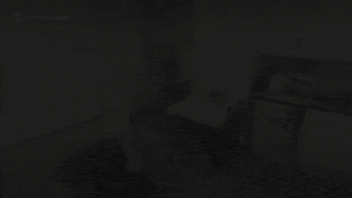

<h1>
  <a href="#"></a>
</h1>

An open-source, end-to-end toolkit for turning real-world scans into simulation-ready 3D environments. Scan a room with the [LiteReality Scanner](https://apps.apple.com/gb/app/litereality/id6774158260); the agent reconstructs the scene, generates articulated assets, resolves layout and collisions, and prepares the environment for robotics simulation.

<p>
  <a href="https://litereality.github.io/agent/" alt="Website">
    
  </a>
  <a href="https://litereality.github.io/agent/litereality-agent-post/" alt="Blog">
    
  </a>
  <a href="https://apps.apple.com/gb/app/litereality/id6774158260" alt="LiteReality Scanner">
    
  </a>
  
</p>

<table align="center" width="100%">
  <tr>
    <td width="50%"></td>
    <td width="50%"></td>
  </tr>
</table>
<p align="center"><sub><b>RGBD scan → agent reconstruction → MuJoCo.</b> One fixed camera through all three stages. The last stage is a shake test at 5.5 m/s² @ 1.5 Hz: every object is a rigid body with mass, colliders and joints.</sub></p>

## News

- ⚙️ **2026-09-09 — Procedural reconstruction with sim-ready physics.** Articulated objects now carry
  their own mass, inertia, colliders and joints, following
  [Articraft](https://github.com/articraftresearch/Articraft), and export to URDF and MJCF.
- 📐 **2026-09-07 — Layout agents.** The noisy layout of a raw scan is settled into a collision-free,
  simulation-ready layout before anything is built from it.
- 🚀 **2026-08-01 — LiteReality-Agent 0.0.** Turn your room scans from the LiteReality Scanner app
  into interactive, realistic 3D.

## How to use

1. **Get the scanner app** — [LiteReality Scanner on the App Store](https://apps.apple.com/gb/app/litereality/id6774158260), free.
2. **Scan your room.** One walkthrough captures the RGB frames, depth, and the RoomPlan
   `room.usdz` the pipeline needs.
3. **Upload the scan** to the machine you'll run on.
4. **Run LiteReality-Agent** — for an articulated,
   realistic room reconstruction.

**Test scenes.** Don't have a scan yet? Clone the example room scans and start from them:

```bash
git clone https://github.com/LiteReality/example-scans.git
uv run litereality run example-scans/<scan>
```

## Requirements

Tested on **macOS** (Apple Silicon) and **Linux** (with a >=24 GB GPU).

1. [`uv`](https://docs.astral.sh/uv/)
2. **Blender 5.x** (tested on 5.1). `BLENDER_PATH` points at the install *directory*, not the binary.
3. **An image-generation API key** for reference images — typically under $1 per scene.
   `OPENAI_API_KEY` by default, or `GEMINI_API_KEY` with `LR_IMAGE_PROVIDER=gemini`.
4. **A logged-in agent CLI on your `PATH`** — this drives all reasoning. `claude`
   (Claude Code) is the default; `codex` (OpenAI Codex) is also supported, selected with
   `LR_AGENT_PROVIDER` in `models.env`.
5. **Somewhere to run TRELLIS and GroundingDINO** — either a [Modal](https://modal.com) account
   (recommended; free tier, no local GPU, works on macOS) or a Linux box with a ≥24 GB NVIDIA GPU.
   See [Install](#install) — this is the one real choice in the setup.

## Install

TRELLIS and GroundingDINO need a GPU. By default they run **hosted on Modal**, which is the
recommended path: nothing heavy runs on your machine, so an Apple Silicon Mac with no GPU is
enough, and detection fans out across several containers at once instead of queueing behind a
single card. Modal's free tier covers this workload comfortably. Got your own Linux GPU? See
[deploy/local-gpu.md](deploy/local-gpu.md) instead.

**1. Install the environment.**

```bash
uv sync --frozen --extra modal --group dev
cp .env.example .env
```

**2. Fill in `.env`.**

| variable | where it comes from |
|---|---|
| `OPENAI_API_KEY` | reference image generation — typically under $1 per scene |
| `GEMINI_API_KEY` | only for `LR_IMAGE_PROVIDER=gemini` → [aistudio.google.com/apikey](https://aistudio.google.com/apikey) |
| `MODAL_TOKEN_ID` · `MODAL_TOKEN_SECRET` | a free [Modal](https://modal.com) account → [modal.com/settings/tokens](https://modal.com/settings/tokens) |
| `BLENDER_PATH` | your Blender install **directory**, not the binary |
| `LR_SCANS_DIR` | the folder holding your scans |

For example:
```dotenv
OPENAI_API_KEY=sk-...
MODAL_TOKEN_ID=ak-...
MODAL_TOKEN_SECRET=as-...
BLENDER_PATH=/Applications/Blender.app/Contents/MacOS
LR_SCANS_DIR=~/scans
```

**3. Deploy the models.**

```bash
uv run litereality setup
```

One-time per workspace. See [deploy/modal/README.md](deploy/modal/README.md) for details.

**4. Check you're ready to go.**

```bash
SANITY_DEEP=1 uv run python sanity.py
```


## Run

The installed CLI is the only supported pipeline entry point. One command runs everything:

```bash
uv run litereality run  scans/<scan>
```

A reconstruction has two stages: **scene init** followed by **authoring**.

Scene init is deterministic.
Authoring is agentic: the agent looks at the seed room, compares it against the capture,
and edits it until it matches. Either half can be run on its own.

```bash
# scene init — capture to seed room. Takes the CAPTURE, writes run/Elliott-Studio/
uv run litereality run scans/<scan> --through seed

# authoring — seed room to finished room. Takes the PACKAGE scene init just produced
uv run litereality stage author run/<scan> --force --polish --live
```

`--polish` adds object refinement and materials on top of authoring. The model-driven quality
pass is separate — add `--quality-pass` for it — because it is the longest agent pass on a run and
nothing downstream reads its output.
`--live` shows how everything is built in real time, alongside the agent's trace. With `--live` the
viewer starts before the room exists and waits for it, so it works on a scene's first authoring
run; it prints its url again once the first build lands.

## Simulate it

The finished room as a MuJoCo scene — bodies rather than one baked mesh, each with the mass,
inertia, friction, colliders and joints its own generated asset was compiled and solver-gated with.

```bash
uv run litereality stage simulate run/<scan>            # -> realism_authoring/mujoco/scene.xml
uv run litereality stage simulate run/<scan> --shake     # ...and measure what actually moves
```

[`doc/Sim-Ready-intergration/Mujoco.md`](doc/Sim-Ready-intergration/Mujoco.md) covers where each
number comes from and what happens to an object that has no compiled physics.

## See the results

```bash
uv run litereality view run/<scan>
```


### The room itself

In the formats you'd take elsewhere:

- `room_preview/Room.glb` — materials baked and clips intact, for Blender / Unity / Unreal / the web
- `room_preview/Room.blend` — the same room as a Blender scene
- `room/` — define the entire room here

## Development

See [ARCHITECTURE.md](ARCHITECTURE.md) for package ownership, dependency direction, and the current
agent tool registry.

Safe local verification is limited to static checks, offline unit tests, CLI parsing, and package
builds:

```bash
uv run ruff check src tests sanity.py scripts
uv run pytest -q
uv build
```

Tests marked `blender`, `scan`, or `live` are excluded by default.

## Citation

A technical report is coming. In the meantime:

```bibtex
@article{huang2026litereality-agent,
  title   = {{LiteReality-Agent}: An Agentic System for
             Interactable 3D Indoor Scene Reconstruction},
  author  = {Huang, Zhening and Li, Yueyan and Chiu, Johnathan and
             Lyu, Xiaoyang and Zhou, Matt and Yao, Yuxin and
             Lasenby, Joan and Wu, Shangzhe},
  year    = {2026}
}
```
