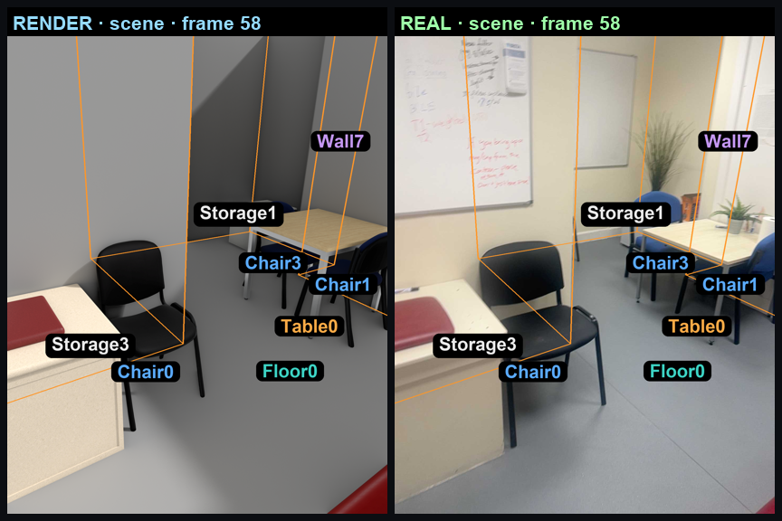
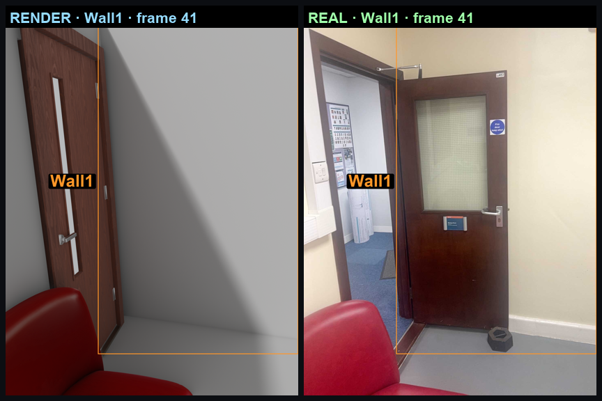
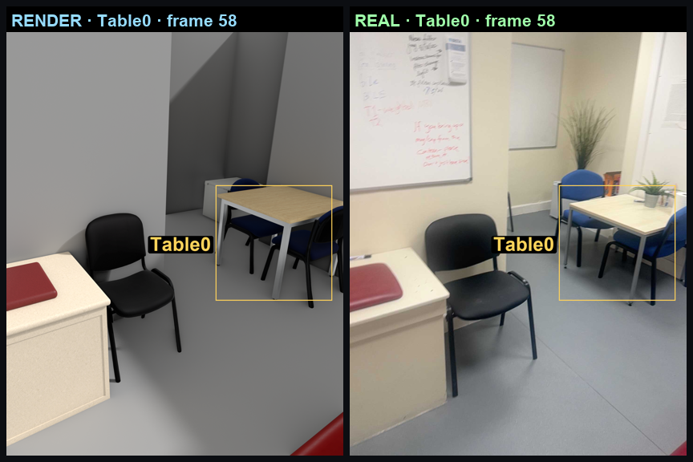

# Rendering and compare

The agent cannot check its own work against a memory of the room. It needs the room it just built
and the photograph of the real room, side by side, in one image.

That pairing is the whole tool. `render` (`agent/tools/render/tool.py`) never produces a render on
its own — every image it returns is **render | real photo** from the same ARKit camera pose, so the
two halves are directly comparable and any difference between them is a real difference.

Three target layers, because an aimless render of everything shows nothing:

1. **`room`** — the whole scene, every object chip-labelled.
2. **`Wall<N>`** — wall-focus: only that wall outlined, on both sides.
3. **`<Object>`** — that object's bounding box drawn on it.

<table>
<tr>
<td width="33%"></td>
<td width="33%"></td>
<td width="33%"></td>
</tr>
<tr>
<td><code>target="room"</code></td>
<td><code>target="Wall1"</code></td>
<td><code>target="Table0"</code></td>
</tr>
</table>

Same frame, same pose, three layers. The wall pair above is the whole argument for the tool: the
render has a flat slab door, the photo has a glazed one with a closer and a sign — a difference you
can only state because the two halves are the same view.

Frames come from [image selection](image_selection.md) when `frames` is omitted, and the reason
each was chosen comes back in `selection` alongside the images.

## Surfaces also get the head-on comparison

For a wall, floor or ceiling, a perspective frame is a poor way to judge colour, pattern, or where
a fixture sits. So the tool attaches a second image: the surface rendered **ortho**, next to the
real capture **rectified and stitched** into the same head-on view. Like for like, no foreshortening
to argue about.

When there is no ortho render yet — a ceiling before its mesh exists, since RoomPlan gives us no
ceiling — it attaches the real stitch alone, so the reference is never simply missing. A stitch
that came out a ~20 px sliver is dropped rather than shown; a smear is not a reference.

## Two invariants that keep a render honest

A render that quietly shows something other than the current room is worse than no render, because
the agent will act on it. Two rules protect that:

- **The room must be freshly compiled.** If `Room.py` changed since the last successful compile, the
  tool recompiles before rendering. A runtime-broken edit then fails with "fix the build first"
  rather than crashing Blender mid-render with something unreadable.
- **Procedural object edits must actually appear.** The render loads each object from the *packed*
  GLB in `_scene_assets/glb/`, not from its `object.py`. So any procedural object whose `object.py`
  is newer than its packed GLB is rebuilt and repacked first. Without this, editing an object and
  re-rendering shows the old object — and the agent concludes its edit did nothing.

## Comparing is a separate tool

`render` produces the pair; it doesn't judge it. `critic` grades images against a stated goal and
returns the issues to fix. Keeping them apart means the same comparison can be looked at by the
agent directly, graded, or ignored — and a grade is never smuggled into what is supposed to be a
photograph.
