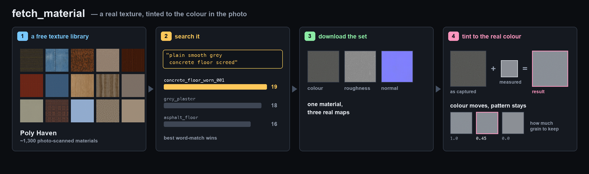

# fetch_material

One of the six capability tools the authoring agent is handed
(`agent/tools/default_registry.py`). Source: `agent/tools/fetch_material/tool.py`.

Procedural node materials look flat next to real captured textures — that was the single biggest
quality gap in the agent-authored rooms. This tool lets the agent reach for a real photographed PBR
set instead of building noise nodes by hand.

The rule of thumb it encodes: **every surface with a visible pattern** — carpet, tile, wood, brick,
plaster grain — should be a fetched texture. A plain painted wall can stay a flat colour plus
roughness.

  

Four steps, on every call — the four panels above:

1. **Search** Poly Haven's texture library for the query — "blue low-pile carpet", "white ceramic
   tile", "oak wood floor".
2. **Download** the winning set's three maps: Diffuse, Rough, and `nor_gl` (OpenGL normal).
   Downloads are md5-checked and cached in `~/.litereality_texcache`, so a base shared by several
   objects is fetched once.
3. **Recolour** the diffuse to a target colour, if one was given. The shift happens in LAB space:
   the texture's mean moves to the target and every pixel keeps its offset from that mean, which is
   what preserves the pattern instead of flattening it to a block of colour.
4. **Save** into the room's own `materials/` directory and merge the recipe into the room's
   `textures.json`.

That last step is why the room definition stores no binaries. `textures.json` is a few KB of recipe
— asset id, map, resolution, and any recolour target — and `room_ops/compile/fetch_textures.py` can
re-materialize every image from it. The room stays reproducible and cheap to move.

# The tool

| parameter | what it does |
|---|---|
| `query` | what to fetch, in words. Name the material, not just the colour. |
| `name` | slug the files are saved under, e.g. `floor_carpet`. Also the recipe key prefix. |
| `color_hex` | optional target colour, e.g. `#356199`. The diffuse is LAB-shifted onto it. |
| `pattern_strength` | 1.0 keeps the full pattern; ~0.6 flattens it for smooth paint. Never 0. |
| `res` | `1k` (default) or `2k`. |

It returns the three file paths, the asset it picked with its categories, three alternatives it
rejected, a preview of the diffuse, and a ready-to-wire Room.py snippet — TexImage(diff) →
BaseColor, TexImage(rough, Non-Color) → Roughness, TexImage(normal, Non-Color) → NormalMap, with
the mapping scale set in real-world metres.

## Why the search is fussier than it looks

Ranking is whole-word overlap against the asset's name, tags and categories — not substring. The
substring version burned us: "blue carpet" matched `bark_bluegum`, a tree bark, through the letters
of *blue*. Three more rules sit on top of it:

- **Material words count double** (`carpet`, `tile`, `wood`, `brick`, `plaster`, …). A colour word
  alone must never be enough to select an asset.
- **An asset matching no material word scores zero** when the query named one.
- **Placement is checked.** "Wall tiles" must not return roof tiles: the right placement is boosted,
  an explicitly different one is quartered.

## When to not use it

Poly Haven is a library of captured surfaces, and it is thin in some categories — carpets and
fabrics especially. When the query names one of those and the winner's categories don't back it up,
the tool returns a **WEAK match** warning rather than pretending. Take it seriously: a procedural
material with the correct colour and roughness beats a confidently wrong texture. The same applies
when the search returns nothing at all — build it procedurally, at real-world scale.
