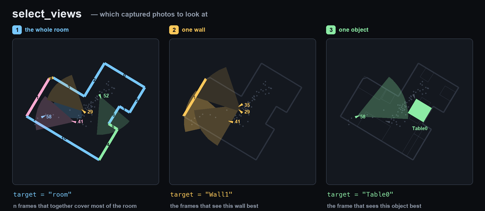

# Image selection

Which capture frames should a tool look at? Every image tool needs an answer, and the one thing the
agent must never do is guess a frame number. An ARKit sweep is hundreds of frames, most of them
near-duplicates of their neighbours, many of them not seeing the thing being asked about at all.

`select_views` (`agent/tools/select_views/tool.py`) is the single answer. `render`, and anything
that consumes frames after it, goes through it.

  

Three targets, three different questions — one per panel above:

1. **`room`** — *the fewest frames that together see every wall.* A greedy weighted set-cover over
   the walls: repeatedly take the frame that adds the most uncovered wall area. It stops when
   coverage is complete and returns **fewer** frames than asked rather than padding the set with
   near-duplicates. If more were explicitly asked for, it tops up with the widest remaining views.
2. **`Wall<N>`** — *the frames where that wall projects largest and on-screen.* Pure wall-plane
   projection against the ARKit camera pose, so no Blender render is needed to answer it.
3. **`<Object>`** — *the frames where that object is clearest*, read from the render manifest's
   per-object visibility. This one needs a prior `render('room')` pass, because object visibility is
   a fact about the render, not about the scan.

`Floor0` and `Ceiling0` aren't planes in the overlay, so they fall back to room coverage.

Returns `{frames: [{frame, score}]}` — the score is why each frame was picked, so a render can
report its own reasoning rather than presenting four frames as if they were obvious.

## The diversity gap

The scan sweeps at roughly one frame per second, so adjacent frames are nearly the same photograph.
Selecting purely on score returns three shutter clicks of one viewpoint and calls it three views.

Every selection therefore enforces a minimum frame-index separation — `max(3, n_frames // 15)` —
between chosen frames. It is a cheap proxy for viewpoint diversity, and it is the difference
between four views of a room and one view rendered four times.

## Surfaces get their own selection

Walls, floors and ceilings run through `agent/tools/shared/image_selection/surface_views.py`, which
picks the minimal set of **sharp** frames covering the surface and reports two signals the prompt
needs: a `blurry` flag when the best available view is still soft, and a coverage percentage saying
how much of the surface the chosen frames actually show. A low number means the capture is thin
there — worth knowing before trusting anything read off those images. Tiny walls are skipped
outright; they aren't worth a pass.
