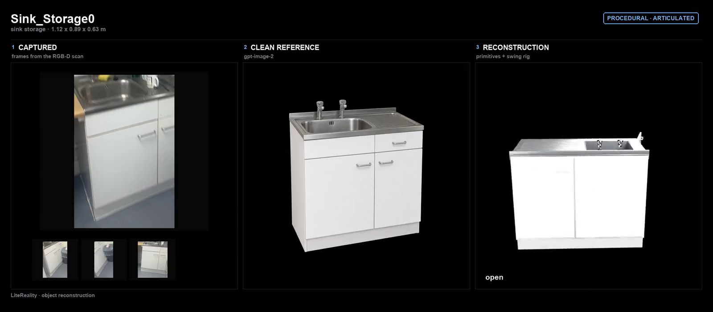
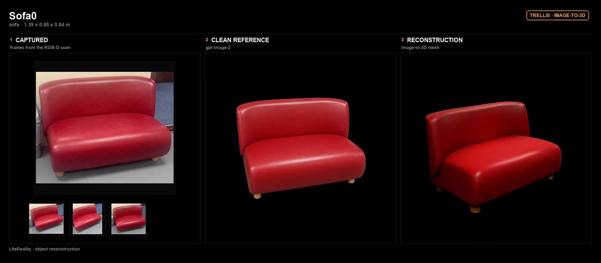

# 3D generation

Every static object in the room is built one of two ways, and the choice is made per object rather
than per scene. Neither route is better; they fail at opposite things.

- **Procedural** — built in Blender from primitives (boxes, cylinders, revolved and extruded
  profiles) plus PBR. Exact dimensions, clean topology, editable afterwards, and it can be
  articulated. Hopeless at anything organic.
- **TRELLIS** — neural image-to-3D from a single clean reference. Handles shapes no one wants to
  describe with primitives. Gives back a mesh nobody can edit, at whatever dimensions it felt like.

<p align="center">
  
  
</p>

Both routes start from the same two things — the frames of the object in the scan, and the clean
reference image `object_init` distils out of them. Only the third panel differs: the sink is built
from primitives and swings open; the sofa is a mesh nothing can take apart.

## The router decides

`pipeline/scene_init/reconstruct/classify/classify_complexity.py` asks a VLM, per object, whether
the geometry is simple and regular enough to build from primitives. The prior it starts from:
chairs, sofas and organic shapes go to TRELLIS; regular furniture and appliances with box, slab or
revolve geometry go procedural.

It writes `routing/<scan>/routing.json`, and each generator reads only its own half.

## The procedural route

`models/object_generation/` — and the important idea here is that RoomPlan only ever detects a
**fixed set of categories**. That is a small enough world to hand-author, so we do:
`category_specs.py` holds a per-category spec covering geometry, materials, and exactly how each
part moves.

The generator injects three things into the agent prompt — the category spec, the object's real
RoomPlan dimensions, and its clean reference image — so the asset both looks right and comes alive
the right way. The dishwasher door drops to horizontal, the drawer pulls out along +Y, the cabinet
door swings on its outer vertical edge.

```
routing.json (procedural) ─► category_specs[category] + bbox + reference ─► agent ─► <name>.glb
```

Each moving part carries glTF node extras — `articulation_type` (revolute or prismatic),
`articulation_axis`, `limit_min`, `limit_max` — readable straight by a simulator. Alongside the GLB
it writes `object.py`, a self-contained Blender rebuild, which is what makes a procedural object
still editable after generation.

## The TRELLIS route

`models/trellis/inference.py` drives TRELLIS.2 (`microsoft/TRELLIS.2-4B`, auto-downloaded on first
run) over the same clean object-only reference PNG that `object_init` produced. Because those
references are already object-only on a near-black background, the gated RMBG-2.0 matting step is
skipped by default.

It needs a GPU. By default it runs hosted on Modal, which is also what lets several objects
generate at once instead of queueing behind one card.

## Both routes are checked before the object enters the room

`pipeline/scene_init/reconstruct/mesh_quality_check` checks each generated asset on its own — the room-level
checks in [`../quality_check/`](../quality_check) only see objects that already passed. A bad asset is cheaper to reject
here than to diagnose later as a room that looks wrong.
